# olmlx User Manual

A comprehensive guide to olmlx — an Ollama-compatible API server powered by Apple's MLX framework for fast local inference on Apple Silicon.

## Table of Contents

- [Introduction](#introduction)
- [Requirements & Installation](#requirements--installation)
- [Quick Start](#quick-start)
- [CLI Reference](#cli-reference)
- [Terminal Chat](#terminal-chat)
- [Model Management](#model-management)
- [API Reference](#api-reference)
- [Configuration Reference](#configuration-reference)
- [Server Architecture & Internals](#server-architecture--internals)
- [LLM in a Flash (Experimental)](#llm-in-a-flash-experimental)
- [Distributed Inference (Experimental)](#distributed-inference-experimental)
- [macOS Service Management](#macos-service-management)
- [Troubleshooting](#troubleshooting)
- [Model Compatibility](#model-compatibility)

---

## Introduction

olmlx is a drop-in replacement for the Ollama API server, built on Apple's [MLX](https://github.com/ml-explore/mlx) framework. It provides faster inference on Mac M-series hardware while remaining compatible with any tool that speaks the Ollama, OpenAI, or Anthropic REST APIs.

### Key Features

- **Ollama API compatibility** — use existing Ollama clients, libraries, and tools without changes
- **OpenAI API compatibility** — works with the OpenAI Python SDK and any OpenAI-compatible client
- **Anthropic Messages API** — use as a backend for Claude Code and other Anthropic API clients
- **Native Apple Silicon acceleration** — runs inference directly on the Metal GPU via MLX
- **Vision-language models** — process images alongside text with VLM support
- **Interactive terminal chat** — full-featured chat with MCP tool servers and skills
- **Prompt caching** — KV cache reuse across requests for faster time-to-first-token
- **LLM in a Flash** — SSD-based inference for running larger models with limited memory
- **Distributed inference** — split large models across multiple Apple Silicon machines
- **macOS service integration** — auto-start on login via launchd

### Architecture Overview

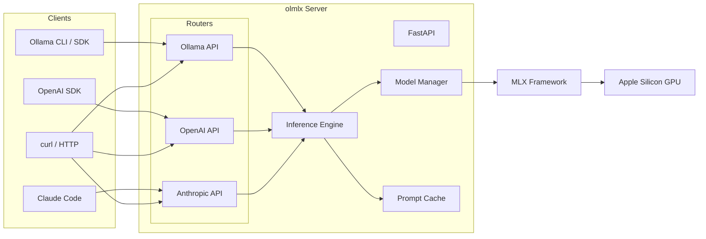

---

## Requirements & Installation

### System Requirements

- **macOS** with Apple Silicon (M1, M2, M3, M4, M5 or later)
- **Python 3.11** or newer
- **[uv](https://docs.astral.sh/uv/)** — fast Python package manager

### Option 1: Global Install (Recommended)

Install olmlx as a global tool — no repository clone needed:

```bash
uv tool install git+ssh://git@github.com/motsognirr/olmlx.git

# Start the server
olmlx
```

### Option 2: From Source

```bash
git clone git@github.com:motsognirr/olmlx.git
cd olmlx
uv sync --no-editable

# Start the server
uv run olmlx
```

### Optional Dependencies

Install the `search` extra for web search support in the chat TUI:

```bash
uv tool install 'git+ssh://git@github.com/motsognirr/olmlx.git[search]'
# or from source:
uv sync --no-editable --extra search
```

### First Run

On first run, olmlx creates:

| Path | Purpose |
|------|---------|
| `~/.olmlx/` | Configuration directory |
| `~/.olmlx/models.json` | Model name-to-HuggingFace mapping (seeded with defaults) |
| `~/.olmlx/models/` | Local model storage |

The server starts on `http://localhost:11434` — the same default port as Ollama.

---

## Quick Start

### 1. Start the server

```bash
olmlx
```

### 2. Pull a model

```bash
curl http://localhost:11434/api/pull -d '{"model": "llama3.2:latest"}'
```

### 3. Chat with the model

```bash
curl http://localhost:11434/api/chat -d '{
  "model": "llama3.2:latest",
  "messages": [{"role": "user", "content": "Hello!"}],
  "stream": false
}'
```

### Sequence Overview

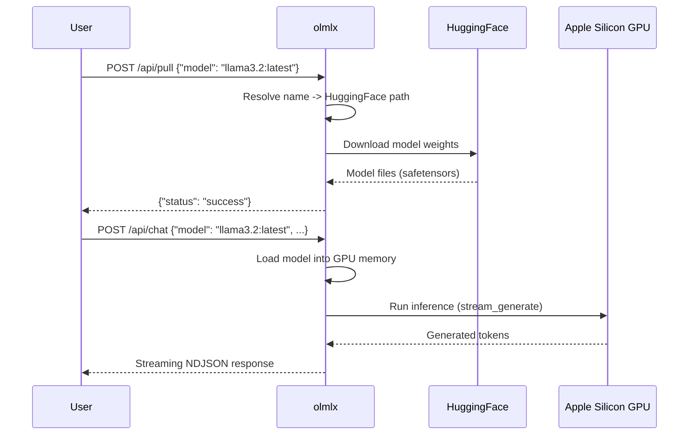

---

## CLI Reference

olmlx provides six command groups. Running `olmlx` with no arguments is equivalent to `olmlx serve`.

### `olmlx serve`

Start the API server.

```bash
olmlx              # implicit
olmlx serve        # explicit
```

The server binds to `OLMLX_HOST:OLMLX_PORT` (default `0.0.0.0:11434`). All configuration is via environment variables or `.env` file (see [Configuration Reference](#configuration-reference)).

### `olmlx chat`

Interactive terminal chat with in-process inference — no server needed.

```bash
olmlx chat <model> [options]
```

| Argument / Flag | Description | Default |
|---|---|---|
| `<model>` | Model name or HuggingFace path | *(required)* |
| `--system`, `-s` | System prompt | *(none)* |
| `--mcp-config` | Path to MCP configuration file | `~/.olmlx/mcp.json` |
| `--no-mcp` | Disable MCP tool servers | *(MCP enabled)* |
| `--no-thinking` | Disable model thinking blocks | *(thinking enabled)* |
| `--max-tokens` | Maximum output tokens per response | `4096` |
| `--max-turns` | Maximum agent loop turns | `25` |
| `--repeat-penalty` | Repetition penalty factor (1.0 = disabled) | `1.1` |
| `--repeat-last-n` | Context window for repetition penalty | `64` |
| `--no-skills` | Disable skill loading | *(skills enabled)* |
| `--no-builtin-tools` | Disable built-in tools | *(enabled)* |
| `--skills-dir` | Custom skills directory | `~/.olmlx/skills` |

**Examples:**

```bash
# Basic chat
olmlx chat qwen3:8b

# With system prompt and thinking disabled
olmlx chat qwen3:8b --system "You are a coding assistant" --no-thinking

# With custom MCP config
olmlx chat qwen3:8b --mcp-config ~/my-tools/mcp.json
```

### `olmlx models`

Model management commands.

```bash
# List locally downloaded models
olmlx models list

# Pull/download a model from HuggingFace
olmlx models pull <model_name>

# Show model details (size, family, quantization, etc.)
olmlx models show <model_name>

# Delete a local model (prompts for confirmation)
olmlx models delete <model_name>

# Delete without confirmation
olmlx models delete <model_name> --yes
```

`olmlx models list` displays a table with columns: **NAME**, **SIZE**, **PARAMS**, **QUANT**, **HF_PATH**.

### `olmlx flash`

LLM in a Flash management commands (see [LLM in a Flash](#llm-in-a-flash-experimental)).

```bash
# Prepare a model for flash inference
olmlx flash prepare <model> [--rank 128] [--samples 256] [--threshold 0.01] [--epochs 5]

# Show flash preparation status
olmlx flash info <model>
```

### `olmlx service`

macOS launchd service management (see [macOS Service Management](#macos-service-management)).

```bash
olmlx service install      # Install and start the launchd service
olmlx service status       # Check service status
olmlx service uninstall    # Stop and remove the service
```

### `olmlx config show`

Display the current configuration, including all resolved environment variables.

```bash
olmlx config show
```

---

## Terminal Chat

`olmlx chat` provides a rich interactive terminal experience with streaming markdown, tool use, and skills — all running inference directly in-process without needing a server.

### Slash Commands

| Command | Description |
|---|---|
| `/exit`, `/quit` | Exit the chat |
| `/clear` | Clear conversation history |
| `/tools` | Show available MCP tools |
| `/skills` | Show loaded skills |
| `/safety` | Display tool safety policy |
| `/system [prompt]` | Set or show the system prompt |
| `/model [name]` | Switch to a different model |
| `/model thinking [on\|off]` | Enable or disable thinking |

Multiline input is supported with a trailing backslash (`\`).

### MCP Tool Servers

olmlx chat connects to external [Model Context Protocol](https://modelcontextprotocol.io/) servers for tool use. Configure servers in `~/.olmlx/mcp.json` using the same format as Claude Desktop:

```json
{
  "mcpServers": {
    "filesystem": {
      "command": "npx",
      "args": ["-y", "@modelcontextprotocol/server-filesystem", "/tmp"]
    },
    "remote-server": {
      "url": "http://localhost:8080/sse"
    }
  }
}
```

- Entries with `command` use **stdio** transport (local subprocess)
- Entries with `url` use **SSE** transport (HTTP server)
- Environment variables can be passed with the `env` key

When tools are available, the model can call them and the results are automatically fed back — a full agent loop.

### Tool Safety

Control which tools require confirmation before execution. Add a `toolSafety` section to your MCP config file:

```json
{
  "mcpServers": { "..." : "..." },
  "toolSafety": {
    "defaultPolicy": "confirm",
    "tools": {
      "read_file": "allow",
      "delete_file": "deny"
    }
  }
}
```

| Policy | Behavior |
|---|---|
| `allow` | Execute without confirmation |
| `confirm` | Ask for user approval before execution |
| `deny` | Block execution entirely |

The default policy is `confirm` if not specified. Built-in tools and skills always bypass the safety policy.

### Built-in Tools

When enabled (default), the chat session provides these tools without any MCP configuration:

| Tool | Parameters | Description |
|---|---|---|
| `read_file` | `path`, `offset?`, `limit?` | Read a file with line numbers (max 10 MB) |
| `write_file` | `path`, `content` | Create or overwrite a file; creates parent directories |
| `edit_file` | `path`, `old_text`, `new_text` | Find-and-replace; `old_text` must match exactly once |
| `glob` | `pattern`, `path?` | Find files by glob pattern (max 500 results) |
| `grep` | `pattern`, `path?` | Regex search in files (max 50 KB output) |
| `bash` | `command`, `timeout?` | Run a shell command (default 120s timeout, max 100 KB output) |
| `web_search` | `query`, `max_results?` | DuckDuckGo search (requires `duckduckgo-search` package) |
| `web_fetch` | `url` | Fetch a URL as text (max 10K chars, HTML stripped) |
| `create_plan` | `content` | Write a markdown plan to `~/.olmlx/plans/plan.md` |
| `update_plan` | `content` | Overwrite an existing plan |
| `read_plan` | *(none)* | Read the current plan |

Disable built-in tools with `--no-builtin-tools`.

### Skills

Skills are markdown files that provide specialized instructions the model can load on demand. Instead of stuffing everything into the system prompt, skill descriptions are listed briefly and the model uses a `use_skill` tool to load the full content only when relevant.

**Setup:**

```bash
mkdir -p ~/.olmlx/skills
cp examples/skills/*.md ~/.olmlx/skills/
```

**Skill file format:**

```markdown
---
name: code-review
description: Structured code review focusing on correctness, clarity, and maintainability
---

When reviewing code, follow this structured approach...
```

The `name` field is required; `description` is optional but recommended — it's shown in the system prompt so the model knows when to use each skill.

**Built-in example skills:**

| Skill | Description |
|---|---|
| `code-review` | Structured review: correctness, clarity, maintainability, security |
| `explain` | Explain code or concepts, adapting depth to the question |
| `commit-message` | Write clear conventional commit messages from diffs |
| `debug` | Systematic debugging: reproduce, isolate, fix, verify |
| `refactor` | Safe refactoring — improve structure without changing behavior |

### Agent Loop

When tools are available, the chat operates as a full agent loop:

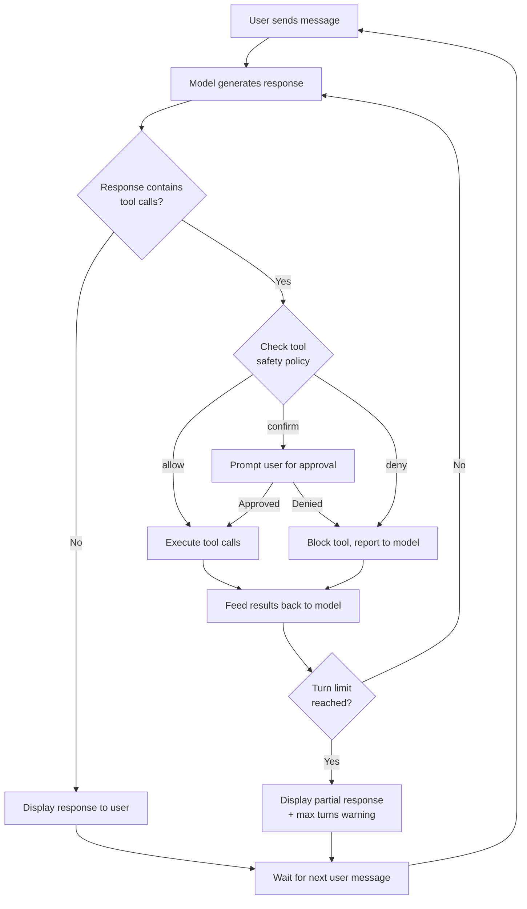

The model can make up to `--max-turns` (default 25) consecutive tool calls before stopping. Repetition detection automatically halts the loop if the model gets stuck repeating the same output.

**Event stream types** (yielded during the agent loop):

| Event Type | Description |
|---|---|
| `token` | Regular text token from the model |
| `thinking_token` | Token from within a thinking block |
| `thinking_start` / `thinking_end` | Thinking block boundaries |
| `tool_call` | Model requests a tool call |
| `tool_result` | Successful tool execution result |
| `tool_error` | Tool execution error |
| `tool_confirmation_needed` | Tool requires user approval |
| `tool_approved` / `tool_denied` | User response to confirmation |
| `max_turns_exceeded` | Agent loop reached turn limit |
| `done` | Generation complete |

---

## Model Management

### Model Name Resolution

olmlx resolves model names through a registry chain:

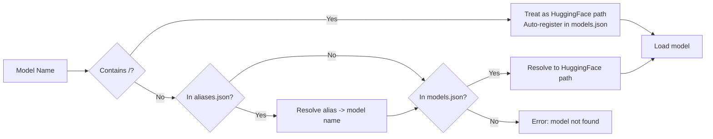

1. **Direct HuggingFace paths** — any name containing `/` is treated as a HF repo ID (e.g., `mlx-community/Qwen3-8B-4bit`)
2. **Aliases** — checked in `~/.olmlx/aliases.json`
3. **Mappings** — checked in `~/.olmlx/models.json`

Names without a `:tag` suffix automatically get `:latest` appended (e.g., `llama3.2` -> `llama3.2:latest`).

### models.json

Edit `~/.olmlx/models.json` to map Ollama-style model names to HuggingFace repos. MLX-format models from [mlx-community](https://huggingface.co/mlx-community) work best:

```json
{
  "llama3.2:latest": "mlx-community/Llama-3.2-3B-Instruct-4bit",
  "mistral:7b": "mlx-community/Mistral-7B-Instruct-v0.3-4bit",
  "qwen2.5:3b": "mlx-community/Qwen2.5-3B-Instruct-4bit",
  "gemma2:2b": "mlx-community/gemma-2-2b-it-4bit"
}
```

These four models are seeded on first run.

### Aliases

Create aliases that point to existing model mappings:

```bash
# Via the API
curl http://localhost:11434/api/copy -d '{
  "source": "llama3.2:latest",
  "destination": "my-llama:latest"
}'
```

Aliases are stored in `~/.olmlx/aliases.json`.

### Auto-Registration

When you use a direct HuggingFace path in an API call (e.g., `Qwen/Qwen3-8B`), olmlx automatically registers it in `models.json` for future use.

### Vision-Language Models

olmlx supports VLMs that process images alongside text. VLMs are automatically detected by inspecting the model's `config.json` for vision-related keys (`vision_config`, `vision_tower`, `image_token_id`, etc.) and loaded via [mlx-vlm](https://github.com/Blaizzy/mlx-vlm) instead of mlx-lm.

**Add a VLM mapping:**

```json
{
  "llava:1.5-7b": "mlx-community/llava-1.5-7b-4bit"
}
```

**Use with the API:**

```bash
curl http://localhost:11434/api/chat -d '{
  "model": "llava:1.5-7b",
  "messages": [{
    "role": "user",
    "content": "What is in this image?",
    "images": ["iVBORw0KGgo..."]
  }]
}'
```

Images must be raw base64 without a `data:image/...;base64,` prefix.

### Modelfile Support

Create models with custom system prompts and parameters using the `/api/create` endpoint:

```bash
curl http://localhost:11434/api/create -d '{
  "model": "my-custom-model",
  "modelfile": "FROM llama3.2:latest\nSYSTEM You are a pirate.\nPARAMETER temperature 0.7"
}'
```

Supported directives: `FROM` (required — base model), `SYSTEM` (system prompt), `PARAMETER` (inference parameters).

---

## API Reference

olmlx exposes three API surfaces. All APIs support both streaming and non-streaming modes.

### Ollama API

Full compatibility with the [Ollama API](https://github.com/ollama/ollama/blob/main/docs/api.md).

#### Status Endpoints

| Endpoint | Method | Description |
|---|---|---|
| `/` | GET, HEAD | Health check — returns `"Ollama is running"` |
| `/api/version` | GET | Server version |
| `/api/ps` | GET | List currently loaded models with expiry info |

**GET /api/ps response:**

```json
{
  "models": [{
    "name": "llama3.2:latest",
    "model": "mlx-community/Llama-3.2-3B-Instruct-4bit",
    "size": 1928000000,
    "expires_at": "2025-03-22T12:05:00Z",
    "size_vram": 1928000000,
    "active_refs": 0
  }]
}
```

#### POST /api/chat — Chat Completion

```bash
curl http://localhost:11434/api/chat -d '{
  "model": "llama3.2:latest",
  "messages": [
    {"role": "system", "content": "You are a helpful assistant."},
    {"role": "user", "content": "What is the capital of France?"}
  ],
  "stream": false,
  "options": {
    "temperature": 0.7,
    "top_p": 0.9,
    "seed": 42
  }
}'
```

**Request fields:**

| Field | Type | Required | Description |
|---|---|---|---|
| `model` | string | Yes | Model name or HuggingFace path |
| `messages` | array | Yes | Conversation messages (`role`, `content`, optional `images`, `tool_calls`) |
| `stream` | boolean | No | Enable streaming (default: `true`) |
| `tools` | array | No | Tool definitions (OpenAI function-calling format) |
| `options` | object | No | Inference parameters (see below) |
| `keep_alive` | string | No | How long to keep model loaded (e.g., `"5m"`, `"0"`, `"-1"`) |
| `format` | string | No | Response format |

**Inference options:**

| Option | Type | Description |
|---|---|---|
| `temperature` | float | Sampling temperature (0 = greedy) |
| `top_p` | float | Nucleus sampling threshold (0-1) |
| `top_k` | int | Top-K sampling |
| `min_p` | float | Minimum probability threshold |
| `seed` | int | Random seed for reproducibility |
| `num_predict` | int | Maximum tokens to generate (-1 = infinite, -2 = fill context) |
| `stop` | array | Stop sequences |
| `repeat_penalty` | float | Repetition penalty (1.0 = disabled) |
| `repeat_last_n` | int | Context window for repetition penalty (-1 = none) |
| `num_ctx` | int | Context window size |
| `presence_penalty` | float | Presence penalty |
| `frequency_penalty` | float | Frequency penalty |

**Streaming response** (NDJSON — one JSON object per line):

```json
{"model":"llama3.2:latest","created_at":"2025-03-22T12:00:00Z","message":{"role":"assistant","content":"The"},"done":false}
{"model":"llama3.2:latest","created_at":"2025-03-22T12:00:00Z","message":{"role":"assistant","content":" capital"},"done":false}
...
{"model":"llama3.2:latest","created_at":"2025-03-22T12:00:00Z","message":{"role":"assistant","content":""},"done":true,"done_reason":"stop","eval_count":42,"prompt_eval_count":15,"eval_duration":1200000000,"prompt_eval_duration":300000000}
```

**Non-streaming response:** A single JSON object with the complete response and timing statistics.

#### POST /api/generate — Text Completion

```bash
curl http://localhost:11434/api/generate -d '{
  "model": "llama3.2:latest",
  "prompt": "Once upon a time",
  "stream": false
}'
```

**Additional fields** (beyond those shared with `/api/chat`):

| Field | Type | Description |
|---|---|---|
| `prompt` | string | Input text |
| `system` | string | System prompt (prepended unless `raw: true`) |
| `images` | array | Base64-encoded images for VLMs |
| `raw` | boolean | Skip system prompt prepending |

#### POST /api/show — Model Details

```bash
curl http://localhost:11434/api/show -d '{"model": "llama3.2:latest"}'
```

Returns model metadata: format, family, parameter size, quantization level, modification date.

#### POST /api/pull — Download Model

```bash
curl http://localhost:11434/api/pull -d '{"model": "llama3.2:latest"}'
```

Streams NDJSON progress events:

```json
{"status": "pulling manifest"}
{"status": "downloading mlx-community/Llama-3.2-3B-Instruct-4bit"}
{"status": "verifying"}
{"status": "success"}
```

#### Model Management Endpoints

| Endpoint | Method | Description |
|---|---|---|
| `/api/tags` | GET | List all available models (downloaded + configured) |
| `/api/copy` | POST | Create a model alias: `{"source": "...", "destination": "..."}` |
| `/api/create` | POST | Create model from Modelfile: `{"model": "...", "modelfile": "..."}` |
| `/api/delete` | DELETE | Delete a model: `{"model": "..."}` |
| `/api/warmup` | POST | Preload model into GPU: `{"model": "...", "keep_alive": "5m"}` |
| `/api/unload` | POST | Manually unload model from GPU: `{"model": "..."}` |
| `/api/abort` | POST | Cancel generation (no-op; disconnect to cancel) |
| `/api/push` | POST | Not implemented (models stored on HuggingFace) |

#### Embedding Endpoints

**POST /api/embed** — Generate embeddings (batch):

```bash
curl http://localhost:11434/api/embed -d '{
  "model": "nomic-embed-text",
  "input": ["Hello world", "Goodbye world"]
}'
```

Response: `{"model": "...", "embeddings": [[0.1, 0.2, ...], [0.3, 0.4, ...]]}`

**POST /api/embeddings** — Generate single embedding (legacy):

```bash
curl http://localhost:11434/api/embeddings -d '{
  "model": "nomic-embed-text",
  "prompt": "Hello world"
}'
```

Response: `{"embedding": [0.1, 0.2, ...]}`

#### Blob Storage

| Endpoint | Method | Description |
|---|---|---|
| `/api/blobs/{digest}` | HEAD | Check if a blob exists (200 or 404) |
| `/api/blobs/{digest}` | POST | Upload a blob (verifies SHA256 digest) |

---

### OpenAI-Compatible API

Use any OpenAI SDK client by pointing it at `http://localhost:11434/v1`.

#### POST /v1/chat/completions

```bash
curl http://localhost:11434/v1/chat/completions \
  -H "Content-Type: application/json" \
  -d '{
    "model": "llama3.2:latest",
    "messages": [{"role": "user", "content": "Hello!"}],
    "temperature": 0.7,
    "stream": true
  }'
```

**Request fields:**

| Field | Type | Description |
|---|---|---|
| `model` | string | Model name (required) |
| `messages` | array | Chat messages with `role` and `content` (required) |
| `temperature` | float | 0-2 range |
| `top_p` | float | 0-1 range |
| `stream` | boolean | Enable SSE streaming |
| `stop` | string/array | Stop sequences |
| `max_tokens` | int | Output token limit |
| `max_completion_tokens` | int | Alias for `max_tokens` (takes precedence) |
| `presence_penalty` | float | -2 to 2 |
| `frequency_penalty` | float | -2 to 2 |
| `tools` | array | Tool definitions |
| `tool_choice` | string/object | Tool selection strategy (`"auto"`, `"none"`, or specific tool) |
| `seed` | int | Random seed |
| `response_format` | object | `{"type": "json_object"}` or `{"type": "json_schema", "json_schema": {...}}` |

**Non-streaming response:**

```json
{
  "id": "chatcmpl-abc123",
  "object": "chat.completion",
  "created": 1711100000,
  "model": "llama3.2:latest",
  "choices": [{
    "index": 0,
    "message": {"role": "assistant", "content": "Hello! How can I help?"},
    "finish_reason": "stop"
  }],
  "usage": {"prompt_tokens": 10, "completion_tokens": 8, "total_tokens": 18}
}
```

**Streaming** uses Server-Sent Events (SSE) with `data: {...}` lines and a final `data: [DONE]` sentinel.

#### POST /v1/completions

Text completion endpoint (same fields as chat, but uses `prompt` instead of `messages`).

```bash
curl http://localhost:11434/v1/completions -d '{
  "model": "llama3.2:latest",
  "prompt": "The meaning of life is",
  "max_tokens": 100
}'
```

#### GET /v1/models

List available models in OpenAI format:

```json
{
  "object": "list",
  "data": [
    {"id": "llama3.2:latest", "object": "model", "created": 1711100000, "owned_by": "olmlx"}
  ]
}
```

#### POST /v1/embeddings

Generate embeddings in OpenAI format:

```bash
curl http://localhost:11434/v1/embeddings -d '{
  "model": "nomic-embed-text",
  "input": ["Hello world"]
}'
```

Response:

```json
{
  "object": "list",
  "data": [{"index": 0, "embedding": [0.1, 0.2, ...], "object": "embedding"}],
  "model": "nomic-embed-text",
  "usage": {"prompt_tokens": 3, "total_tokens": 3}
}
```

#### Using the OpenAI Python SDK

```python
from openai import OpenAI

client = OpenAI(base_url="http://localhost:11434/v1", api_key="unused")

response = client.chat.completions.create(
    model="llama3.2:latest",
    messages=[{"role": "user", "content": "Hello!"}],
)
print(response.choices[0].message.content)
```

#### Using the Ollama Python SDK

```python
import ollama

client = ollama.Client(host="http://localhost:11434")
response = client.chat(
    model="llama3.2:latest",
    messages=[{"role": "user", "content": "Hello!"}],
)
print(response["message"]["content"])
```

#### JSON Mode / Structured Output

Request JSON responses using `response_format`:

```python
response = client.chat.completions.create(
    model="qwen2.5:3b",
    messages=[{"role": "user", "content": "List 3 colors as JSON"}],
    response_format={"type": "json_object"},
)
```

For schema-constrained output:

```python
response = client.chat.completions.create(
    model="qwen2.5:3b",
    messages=[{"role": "user", "content": "List 3 colors"}],
    response_format={
        "type": "json_schema",
        "json_schema": {
            "name": "colors",
            "schema": {
                "type": "object",
                "properties": {
                    "colors": {"type": "array", "items": {"type": "string"}}
                }
            }
        }
    },
)
```

> **Note:** JSON mode appends an instruction to the system prompt. Schema enforcement is not strictly applied — the model is instructed to follow the schema but may deviate.

---

### Anthropic Messages API

olmlx implements the [Anthropic Messages API](https://docs.anthropic.com/en/api/messages), enabling use as a backend for tools like Claude Code.

#### POST /v1/messages

```bash
curl http://localhost:11434/v1/messages \
  -H "Content-Type: application/json" \
  -H "x-api-key: unused" \
  -H "anthropic-version: 2023-06-01" \
  -d '{
    "model": "claude-3-5-sonnet-20241022",
    "max_tokens": 1024,
    "messages": [{"role": "user", "content": "Hello!"}]
  }'
```

**Request fields:**

| Field | Type | Description |
|---|---|---|
| `model` | string | Model name (required). Claude model names are auto-resolved via `OLMLX_ANTHROPIC_MODELS` |
| `messages` | array | Messages with `role` and `content` (string or content block array) (required) |
| `max_tokens` | int | Output token limit (default: 4096) |
| `stream` | boolean | Enable SSE streaming |
| `temperature` | float | 0-1 range |
| `top_p` | float | 0-1 range |
| `top_k` | int | Top-K sampling |
| `stop_sequences` | array | Stop strings |
| `system` | string/array | System prompt (string or content block array) |
| `tools` | array | Tool definitions with `name`, `description`, `input_schema` |
| `tool_choice` | object | Tool selection strategy |
| `thinking` | object | `{"type": "enabled", "budget_tokens": 5000}`, `{"type": "disabled"}`, or `{"type": "adaptive"}` |
| `metadata` | object | Custom metadata |

**Non-streaming response:**

```json
{
  "id": "msg_abc123",
  "type": "message",
  "role": "assistant",
  "content": [
    {"type": "thinking", "thinking": "Let me consider..."},
    {"type": "text", "text": "Hello! How can I help you today?"}
  ],
  "model": "qwen3:8b",
  "stop_reason": "end_turn",
  "usage": {
    "input_tokens": 12,
    "output_tokens": 45,
    "cache_creation_input_tokens": 0,
    "cache_read_input_tokens": 0
  }
}
```

**Streaming** uses SSE with event types: `message_start`, `content_block_start`, `content_block_delta`, `content_block_stop`, `message_delta`, `message_stop`, and `ping` (keep-alive every 5s).

**Content block types:**

| Type | Fields | Description |
|---|---|---|
| `text` | `text` | Regular text response |
| `thinking` | `thinking` | Model's reasoning (from `<think>` tags) |
| `tool_use` | `id`, `name`, `input` | Model requesting a tool call |
| `tool_result` | `tool_use_id`, `content`, `is_error` | Result of a tool call (in user messages) |

#### POST /v1/messages/count_tokens

Count tokens without generating a response:

```bash
curl http://localhost:11434/v1/messages/count_tokens \
  -H "Content-Type: application/json" \
  -d '{
    "model": "qwen3:8b",
    "messages": [{"role": "user", "content": "Hello!"}],
    "max_tokens": 1024
  }'
```

Response: `{"input_tokens": 12}`

#### Thinking Blocks

Models that support thinking (Qwen 3+) can output reasoning before their response. olmlx parses `<think>...</think>` tags from model output and converts them to Anthropic-style thinking content blocks.

Control thinking via the `thinking` parameter:

```json
{
  "thinking": {"type": "enabled", "budget_tokens": 10000}
}
```

Or disable:

```json
{
  "thinking": {"type": "disabled"}
}
```

#### Tool Use

Define tools in Anthropic format — olmlx converts them to the model's native format internally:

```json
{
  "tools": [{
    "name": "get_weather",
    "description": "Get current weather for a location",
    "input_schema": {
      "type": "object",
      "properties": {
        "location": {"type": "string", "description": "City name"}
      },
      "required": ["location"]
    }
  }]
}
```

When the model uses a tool, the response contains a `tool_use` content block with `stop_reason: "tool_use"`. Feed the result back as a `tool_result` message to continue the conversation:

```json
{
  "messages": [
    {"role": "user", "content": "What's the weather in Paris?"},
    {"role": "assistant", "content": [
      {"type": "tool_use", "id": "toolu_abc123", "name": "get_weather", "input": {"location": "Paris"}}
    ]},
    {"role": "user", "content": [
      {"type": "tool_result", "tool_use_id": "toolu_abc123", "content": "Sunny, 22C"}
    ]}
  ]
}
```

#### Model Name Mapping

Map Claude model names to local models via `OLMLX_ANTHROPIC_MODELS`:

```bash
# In .env or environment
OLMLX_ANTHROPIC_MODELS='{"claude_3_5_sonnet_20241022": "mlx-community/Qwen3-8B-4bit"}'
```

> **Note:** Keys use underscores instead of dashes (environment variable parsing constraint). The key `claude_3_5_sonnet_20241022` matches API requests for `claude-3-5-sonnet-20241022`.

#### Using with Claude Code

Point Claude Code at your olmlx instance:

```bash
export ANTHROPIC_BASE_URL=http://localhost:11434
export ANTHROPIC_API_KEY=unused
claude
```

Configure the model mapping so Claude Code's model names resolve to your local models.

### Prompt Cache Header

All inference endpoints (Ollama, OpenAI, and Anthropic) support the optional `x-cache-id` header (max 256 characters). This identifies a conversation for KV cache reuse, significantly reducing time-to-first-token for multi-turn conversations.

```bash
curl http://localhost:11434/v1/chat/completions \
  -H "x-cache-id: conversation-123" \
  -d '{"model": "qwen3:8b", "messages": [...]}'
```

---

## Configuration Reference

All settings are configured via `OLMLX_`-prefixed environment variables. You can also place them in a `.env` file in the project root.

### Core Settings

| Variable | Type | Default | Description |
|---|---|---|---|
| `OLMLX_HOST` | string | `0.0.0.0` | Server bind address |
| `OLMLX_PORT` | int | `11434` | Server port (1-65535) |
| `OLMLX_MODELS_DIR` | path | `~/.olmlx/models` | Local model storage directory |
| `OLMLX_MODELS_CONFIG` | path | `~/.olmlx/models.json` | Model name->HF path mapping file |
| `OLMLX_DEFAULT_KEEP_ALIVE` | string | `5m` | How long idle models stay loaded. `0` = unload immediately, `-1` = never unload, or duration like `5m`, `1h` |
| `OLMLX_MAX_LOADED_MODELS` | int | `1` | Max models loaded concurrently (LRU eviction when exceeded) |
| `OLMLX_MEMORY_LIMIT_FRACTION` | float | `0.75` | Max fraction of system RAM for Metal GPU memory (0-1]. Models exceeding this are rejected with HTTP 503 |
| `OLMLX_MODEL_LOAD_TIMEOUT` | float/None | `None` | Timeout in seconds for model loading. `None` = no timeout |
| `OLMLX_LOG_LEVEL` | string | `INFO` | Logging level: `DEBUG`, `INFO`, `WARNING`, `ERROR`, `CRITICAL` |
| `OLMLX_INFERENCE_QUEUE_TIMEOUT` | float/None | `300.0` | Max seconds to wait for inference lock (5 min). `None` = no timeout |
| `OLMLX_CORS_ORIGINS` | list | `["http://localhost:*", "http://127.0.0.1:*"]` | Allowed CORS origins |
| `OLMLX_ANTHROPIC_MODELS` | dict | `{}` | Claude model name->local model mapping for the Anthropic endpoint |

### Prompt Cache Settings

| Variable | Type | Default | Description |
|---|---|---|---|
| `OLMLX_PROMPT_CACHE` | bool | `true` | Enable KV cache reuse across requests |
| `OLMLX_PROMPT_CACHE_MAX_TOKENS` | int | `32768` | Invalidate cache after conversation exceeds this many tokens |
| `OLMLX_PROMPT_CACHE_MAX_SLOTS` | int | `4` | Maximum in-memory KV cache slots |
| `OLMLX_PROMPT_CACHE_DISK` | bool | `false` | Enable disk-based KV cache offload |
| `OLMLX_PROMPT_CACHE_DISK_PATH` | path | `~/.olmlx/cache/kv` | Directory for disk KV cache |
| `OLMLX_PROMPT_CACHE_DISK_MAX_GB` | float | `10.0` | Maximum disk space for KV cache in GB |

### Flash Inference Settings (Experimental)

| Variable | Type | Default | Description |
|---|---|---|---|
| `OLMLX_EXPERIMENTAL_FLASH` | bool | `false` | Enable LLM in a Flash inference |
| `OLMLX_EXPERIMENTAL_FLASH_SPARSITY_THRESHOLD` | float | `0.5` | Activation sparsity threshold (0-1] |
| `OLMLX_EXPERIMENTAL_FLASH_MIN_ACTIVE_NEURONS` | int | `128` | Minimum active neurons per layer |
| `OLMLX_EXPERIMENTAL_FLASH_MAX_ACTIVE_NEURONS` | int/None | `None` | Maximum active neurons per layer (None = unlimited) |
| `OLMLX_EXPERIMENTAL_FLASH_WINDOW_SIZE` | int | `5` | SSD window size for activation prediction |
| `OLMLX_EXPERIMENTAL_FLASH_IO_THREADS` | int | `32` | I/O threads for SSD weight loading |
| `OLMLX_EXPERIMENTAL_FLASH_CACHE_BUDGET_NEURONS` | int | `1024` | Budget for cached neurons in memory |

### Distributed Inference Settings (Experimental)

| Variable | Type | Default | Description |
|---|---|---|---|
| `OLMLX_EXPERIMENTAL_DISTRIBUTED` | bool | `false` | Enable distributed inference |
| `OLMLX_EXPERIMENTAL_DISTRIBUTED_STRATEGY` | string | `tensor` | Sharding strategy: `tensor` or `pipeline` |
| `OLMLX_EXPERIMENTAL_DISTRIBUTED_HOSTFILE` | path | `~/.olmlx/hostfile.json` | Path to hostfile |
| `OLMLX_EXPERIMENTAL_DISTRIBUTED_BACKEND` | string | `ring` | MLX distributed backend |
| `OLMLX_EXPERIMENTAL_DISTRIBUTED_PORT` | int | `32323` | Base port for ring backend |
| `OLMLX_EXPERIMENTAL_DISTRIBUTED_SIDEBAND_PORT` | int | `32400` | TCP port for coordinator-worker communication |
| `OLMLX_EXPERIMENTAL_DISTRIBUTED_SECRET` | string | *(empty)* | Shared secret for worker authentication |
| `OLMLX_EXPERIMENTAL_DISTRIBUTED_REMOTE_WORKING_DIR` | string | *(empty)* | Working directory on remote workers |
| `OLMLX_EXPERIMENTAL_DISTRIBUTED_REMOTE_PYTHON` | string | `python` | Python command on remote workers (e.g., `.venv/bin/python` or `uv run python`) |
| `OLMLX_EXPERIMENTAL_DISTRIBUTED_PRE_SHARD` | bool | `true` | Pre-shard model weights before distribution |
| `OLMLX_EXPERIMENTAL_DISTRIBUTED_SHARD_DIR` | path | `~/.olmlx/shards` | Local directory for pre-sharded weights |
| `OLMLX_EXPERIMENTAL_DISTRIBUTED_WORKER_SHARD_DIR` | string | `~/.olmlx/shards` | Shard directory on remote workers |

### Configuration Precedence

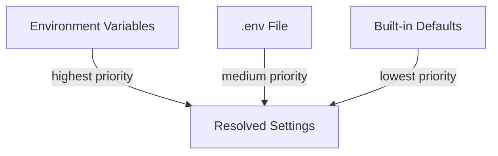

---

## Server Architecture & Internals

### Request Processing Flow

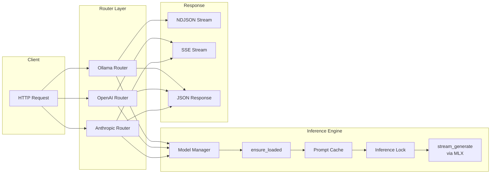

### Model Lifecycle

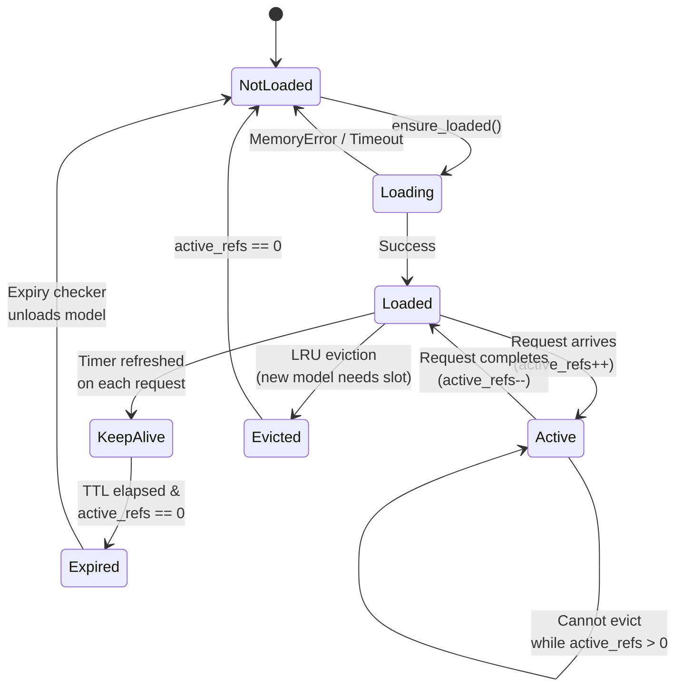

**Key behaviors:**

- **LRU eviction**: When `OLMLX_MAX_LOADED_MODELS` is reached, the least-recently-used model with `active_refs == 0` is unloaded
- **Memory safety**: After loading, Metal memory (active + cache) is checked against `OLMLX_MEMORY_LIMIT_FRACTION` of system RAM. Oversized models are rejected with HTTP 503 to prevent uncatchable Metal OOM crashes
- **Active inference protection**: Models with `active_refs > 0` are never evicted or expired
- **Keep-alive**: Each request refreshes the model's expiry timer. Background task checks every 30 seconds for expired models

### Streaming Bridge

olmlx bridges synchronous MLX generation into async FastAPI responses:

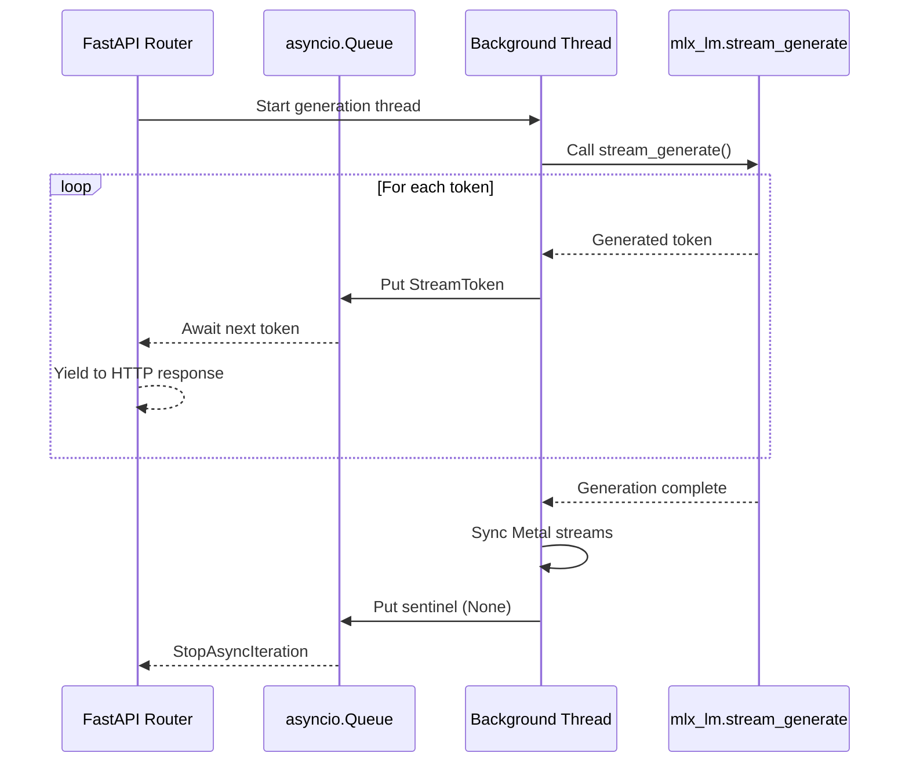

The queue has a max size of 32 items to provide backpressure. On client disconnect, the cancellation event is set and the thread drains cleanly, ensuring GPU resources are released.

### Prompt Caching

When enabled (`OLMLX_PROMPT_CACHE=true`), olmlx reuses KV cache state across requests that share a common prompt prefix. This significantly reduces time-to-first-token for multi-turn conversations.

**How it works:**

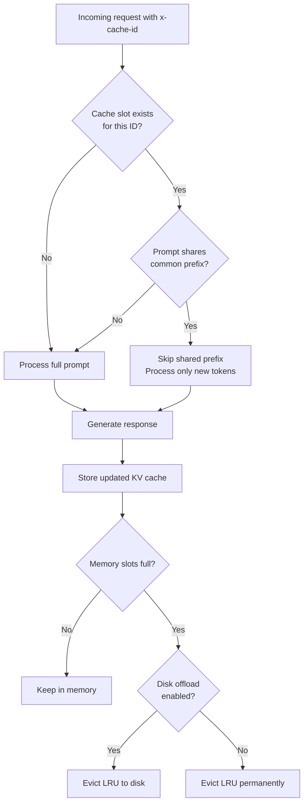

1. Each request can include an `x-cache-id` header identifying the conversation
2. On cache hit, the engine skips recomputing the shared prefix and only processes new tokens
3. After generation, the updated cache state (prompt + generated tokens) is stored
4. Cache slots are managed LRU with a configurable maximum (`OLMLX_PROMPT_CACHE_MAX_SLOTS`)
5. Optional disk offload saves evicted cache entries to disk for later retrieval

**Limitations:**

- Cache is invalidated when total tokens exceed `OLMLX_PROMPT_CACHE_MAX_TOKENS`
- Prompt caching is disabled in distributed mode
- Each model maintains its own cache store

### Tool Call Parsing

olmlx parses tool calls from model output in multiple formats, supporting a wide range of models:

| Format | Pattern | Models |
|---|---|---|
| Qwen | `<tool_call>{"name": ..., "arguments": ...}</tool_call>` | Qwen 2.5, Qwen 3 |
| Mistral | `[TOOL_CALLS] [{"name": ..., "arguments": ...}]` | Mistral, Mistral Nemo |
| Llama | `<\|python_tag\|>{"name": ..., "parameters": ...}` | Llama 3.1, 3.2 |
| DeepSeek | `<\|tool_calls_begin\|>...<\|tool_calls_end\|>` | DeepSeek |
| XML | `<function=Name><parameter=key>value</parameter></function>` | Various |
| Bare JSON | `{"name": "...", "arguments": {...}}` | Fallback |

Parsers are tried in order; the first successful match is used. Tool calls are converted to a unified format before being returned in the API response.

### Inference Concurrency

A single global inference lock prevents concurrent Metal command buffer submission across all models. This sacrifices parallelism for stability on Apple Silicon — concurrent Metal operations can cause GPU crashes. The lock uses a configurable queue timeout (`OLMLX_INFERENCE_QUEUE_TIMEOUT`, default 300s) and returns HTTP 503 with `Retry-After` when the queue is full.

### Error Handling

| Error Type | HTTP Status | API Error Code | Description |
|---|---|---|---|
| `ValueError` | 400 | `invalid_request_error` | Invalid request parameters |
| `MemoryError` | 503 | `overloaded_error` | Model exceeds memory limit |
| `ModelLoadTimeoutError` | 504 | `api_error` | Model load timed out |
| `ServerBusyError` | 503 | `overloaded_error` | Inference queue timeout (includes `Retry-After: 5`) |
| `RuntimeError` | 500 | `api_error` | Internal server error |

Error response format matches the API surface being used (Ollama, OpenAI, or Anthropic format).

---

## LLM in a Flash (Experimental)

LLM in a Flash enables SSD-based inference, allowing you to run models that are larger than available GPU memory by keeping only the most active neurons in memory and loading the rest from disk on demand.

### How It Works

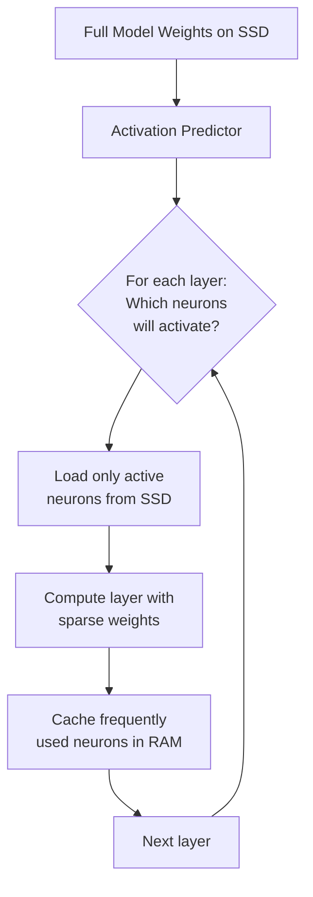

The approach works in two phases:

1. **Preparation** (offline, one-time): Analyzes the model to determine activation sparsity patterns and trains lightweight predictor networks that can forecast which neurons will be needed for each input
2. **Inference** (online): Uses the predictors to load only the required weight slices from SSD, dramatically reducing memory requirements at the cost of some inference speed

### Preparation

Before using flash inference, you must prepare the model:

```bash
olmlx flash prepare <model> [options]
```

| Option | Default | Description |
|---|---|---|
| `--rank` | `128` | Predictor rank — higher values improve prediction accuracy but increase predictor size |
| `--samples` | `256` | Number of calibration samples for activation analysis |
| `--threshold` | `0.01` | Activation threshold — neurons below this value are considered inactive |
| `--epochs` | `5` | Training epochs for predictor networks |

**Example:**

```bash
# Prepare a 32B model for flash inference
olmlx flash prepare mlx-community/Qwen2.5-32B-Instruct-4bit

# With custom settings for better accuracy
olmlx flash prepare mlx-community/Qwen2.5-32B-Instruct-4bit \
  --rank 256 --samples 512 --epochs 10
```

The preparation process:
1. Downloads the model if not already present
2. Runs calibration data through the model to measure activation sparsity per layer
3. Trains small predictor networks for each layer's feed-forward block
4. Saves predictor weights and metadata to `<model_dir>/flash/`

### Checking Preparation Status

```bash
olmlx flash info <model>
```

Shows:
- Whether the model is prepared for flash inference
- Hidden/intermediate layer sizes and layer count
- Predictor rank and calibration sample count
- Number of weight and predictor files
- Total flash data size on disk

### Enabling Flash Inference

Once a model is prepared, enable flash inference for the server:

```bash
OLMLX_EXPERIMENTAL_FLASH=true olmlx serve
```

Or in your `.env` file:

```bash
OLMLX_EXPERIMENTAL_FLASH=true
OLMLX_EXPERIMENTAL_FLASH_SPARSITY_THRESHOLD=0.5
OLMLX_EXPERIMENTAL_FLASH_IO_THREADS=32
OLMLX_EXPERIMENTAL_FLASH_WINDOW_SIZE=5
OLMLX_EXPERIMENTAL_FLASH_MIN_ACTIVE_NEURONS=128
OLMLX_EXPERIMENTAL_FLASH_CACHE_BUDGET_NEURONS=1024
```

### Configuration Parameters

| Parameter | Default | Description |
|---|---|---|
| `sparsity_threshold` | `0.5` | Fraction of neurons that must be inactive for a layer to use sparse loading. Lower values mean more layers use flash (more memory savings, slower) |
| `min_active_neurons` | `128` | Minimum neurons loaded per layer regardless of predictions — prevents too-aggressive sparsity |
| `max_active_neurons` | `None` | Maximum neurons per layer (None = no cap) |
| `window_size` | `5` | Number of recent tokens considered by the activation predictor |
| `io_threads` | `32` | Parallel I/O threads for loading weight slices from SSD — higher values improve throughput on fast NVMe drives |
| `cache_budget_neurons` | `1024` | Number of frequently-used neurons kept in RAM across inference steps |

### Performance Considerations

- **SSD speed matters**: NVMe SSDs provide significantly better throughput than SATA SSDs
- **Tradeoff**: Flash inference trades inference speed for memory efficiency — expect slower token generation compared to fully in-memory inference
- **Preparation time**: The one-time preparation step can take several minutes depending on model size and calibration sample count
- **Best for**: Models that are 1.5-2x larger than available GPU memory, where you'd otherwise be unable to run them at all

---

## Distributed Inference (Experimental)

Run models across multiple Apple Silicon machines using MLX's ring distributed backend. This enables models too large for a single machine — e.g., a 72B model split across two Mac Minis.

### Architecture

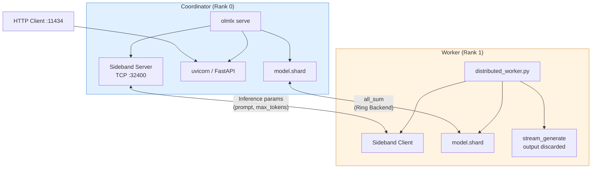

### Startup Sequence

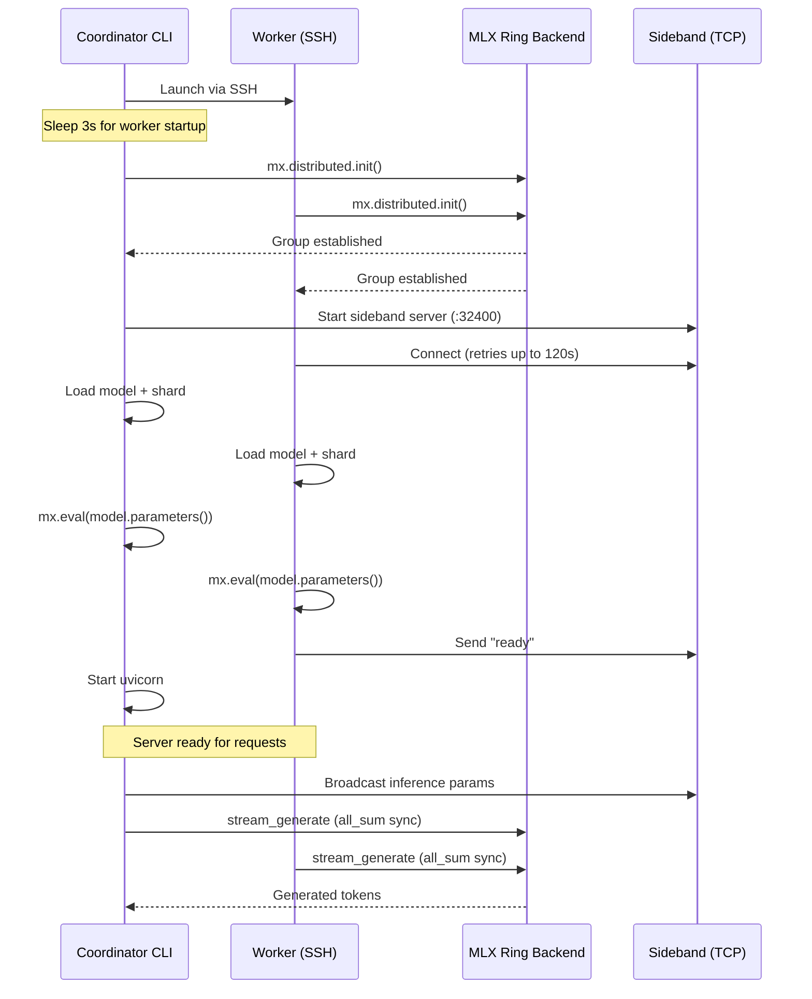

### Prerequisites

- Two or more Apple Silicon Macs on the same network (Thunderbolt recommended)
- Passwordless SSH from coordinator to all workers
- Same olmlx version installed on all machines
- Same model downloaded on all machines

### Setup

**1. Install on all machines:**

```bash
git clone <repo-url> ~/Documents/olmlx_distributed
cd ~/Documents/olmlx_distributed
uv sync --no-editable
```

**2. Set up passwordless SSH (from coordinator):**

```bash
ssh-copy-id user@worker-ip
ssh-keyscan -H worker-ip >> ~/.ssh/known_hosts

# Verify
ssh -o BatchMode=yes user@worker-ip hostname
```

**3. Create hostfile on coordinator:**

```bash
cat > ~/.olmlx/hostfile.json << 'EOF'
{
  "hosts": ["10.0.1.1", "10.0.1.2"],
  "model": "mlx-community/Qwen2.5-32B-Instruct-4bit"
}
EOF
```

The first host is the coordinator (rank 0). Use Thunderbolt IPs for best performance.

**Hostfile fields:**

| Field | Required | Description |
|---|---|---|
| `hosts` | Yes | List of host IPs/hostnames. First = coordinator |
| `model` | Yes | HuggingFace model path (must be the same on all machines) |
| `strategy` | No | `"tensor"` (default) or `"pipeline"` |
| `layers` | No | Layer counts per host for pipeline strategy |

**4. Configure coordinator** (`.env` or environment):

```bash
OLMLX_EXPERIMENTAL_DISTRIBUTED=true
OLMLX_EXPERIMENTAL_DISTRIBUTED_HOSTFILE=~/.olmlx/hostfile.json
OLMLX_EXPERIMENTAL_DISTRIBUTED_REMOTE_WORKING_DIR=~/Documents/olmlx_distributed
OLMLX_EXPERIMENTAL_DISTRIBUTED_REMOTE_PYTHON=.venv/bin/python
OLMLX_HOST=0.0.0.0
```

**5. Pre-download the model on all machines:**

```bash
.venv/bin/python -c "import mlx_lm; mlx_lm.load('mlx-community/Qwen2.5-32B-Instruct-4bit')"
```

**6. Start (coordinator only):**

```bash
cd ~/Documents/olmlx_distributed
.venv/bin/python -m olmlx serve
```

Workers are launched automatically via SSH. Monitor with:

```bash
tail -f ~/.olmlx/worker-1.log
```

**7. Send requests:**

```bash
curl http://coordinator-ip:11434/api/chat -d '{
  "model": "mlx-community/Qwen2.5-32B-Instruct-4bit",
  "messages": [{"role": "user", "content": "Hello!"}],
  "stream": false
}'
```

### Sharding Strategies

| Strategy | Description | Best For |
|---|---|---|
| **Tensor** (default) | Splits weight tensors across ranks. All ranks compute every layer with partial tensors, synchronized via `all_sum` | Even memory distribution, models with many large layers |
| **Pipeline** | Assigns complete layers to different ranks. Each rank processes a subset of layers | Uneven memory machines, reducing communication overhead |

### Pre-Sharding

When `OLMLX_EXPERIMENTAL_DISTRIBUTED_PRE_SHARD=true` (default), the coordinator:

1. Loads the full model
2. Shards weights to each rank
3. Saves per-rank weights to `~/.olmlx/shards/`
4. Workers reload pre-sharded weights on subsequent runs (faster startup)

### Performance Characteristics

Tested with two M4 Mac Minis (64GB + 24GB) connected via Thunderbolt:

| Model | Setup | Time | Notes |
|---|---|---|---|
| Qwen2.5-14B-4bit (~8GB) | Standalone (64GB) | -- | Fits easily |
| Qwen2.5-14B-4bit (~8GB) | Distributed (WiFi) | 66.2s | ~300 tokens |
| Qwen2.5-14B-4bit (~8GB) | Distributed (Thunderbolt) | 46.9s | ~30% faster |
| Qwen2.5-32B-4bit (~18GB) | Standalone (64GB) | 28.4s | Fits on one machine |
| Qwen2.5-32B-4bit (~18GB) | Distributed (Thunderbolt) | 74.9s | ~9GB per shard |

**Key takeaways:**

- Distributed adds per-token latency from `all_sum` network synchronization
- For models that fit on a single machine, standalone is always faster
- Thunderbolt is ~30% faster than WiFi for distributed inference
- The value is enabling models that don't fit on one machine (e.g., 72B across two 64GB machines)

### Limitations

- Only one model can be used (specified in hostfile, loaded at worker startup)
- The requested model must match the hostfile model
- VLM (vision-language) models are not supported
- Prompt caching is disabled in distributed mode
- If the coordinator crashes mid-inference, workers hang indefinitely (MLX has no timeout on collective operations)
- All machines must have the model downloaded locally

---

## macOS Service Management

olmlx can run as a macOS launchd service that starts automatically on login and restarts on crash.

### Install

```bash
olmlx service install
```

This creates a launchd plist at `~/Library/LaunchAgents/com.dpalmqvist.olmlx.plist` with:

- **RunAtLoad**: starts when the plist is loaded (and on login)
- **KeepAlive**: restarts if the process exits
- **Environment**: forwards all current `OLMLX_*` environment variables
- **Logs**: writes to `~/.olmlx/olmlx.log`

### Check Status

```bash
olmlx service status
```

Runs `launchctl list com.dpalmqvist.olmlx` to show the service state.

### Uninstall

```bash
olmlx service uninstall
```

Stops the service and removes the plist file.

### Viewing Logs

```bash
tail -f ~/.olmlx/olmlx.log
```

---

## Troubleshooting

### "Model not found" Errors

When you see `Model 'X' not found`, the model name isn't in the registry. Fix by:

1. **Add a mapping** to `~/.olmlx/models.json`:
   ```json
   {"my-model:latest": "mlx-community/Model-Repo-Name"}
   ```

2. **Use a HuggingFace path directly**:
   ```bash
   curl http://localhost:11434/api/generate -d '{
     "model": "mlx-community/Qwen2.5-3B-Instruct-4bit",
     "prompt": "Hello"
   }'
   ```

### Metal GPU Crashes / Out of Memory

olmlx checks Metal GPU memory after loading and rejects models that exceed `OLMLX_MEMORY_LIMIT_FRACTION` (default: 75% of system RAM) with HTTP 503.

If you still experience issues:

1. **Use a smaller model** — try 4-bit quantized models instead of 8-bit or 16-bit
2. **Increase the limit** — `OLMLX_MEMORY_LIMIT_FRACTION=0.85` if you have headroom
3. **Try flash inference** — enable LLM in a Flash for models that barely exceed memory (`OLMLX_EXPERIMENTAL_FLASH=true`)
4. **Free memory** — close other GPU-heavy applications
5. **Check logs** — `~/.olmlx/olmlx.log` if running as a service

### Model Won't Unload / Memory Pressure

Models stay loaded based on `OLMLX_DEFAULT_KEEP_ALIVE`:

| Value | Behavior |
|---|---|
| `5m` (default) | Unload after 5 minutes idle |
| `0` | Unload immediately after use |
| `-1` | Never unload |

**Force unload:**

```bash
curl -X POST http://localhost:11434/api/unload -d '{"model": "llama3.2:latest"}'
```

**Check loaded models:**

```bash
curl http://localhost:11434/api/ps
```

The `active_refs` field shows active requests. Models with `active_refs > 0` cannot be unloaded.

### Context Window Limits

If responses are cut off:

1. Shorten your prompt — remove old messages from the conversation
2. Use a model with larger context (some support 32K+ tokens)
3. Check the model's documentation for its actual context limit

### Tool Calling Not Working

Tool calling requires:

1. A model with tool calling capability (Qwen 2.5+, Llama 3.1+, Mistral Nemo)
2. Tools passed in the request
3. A chat template that supports tools

If the template doesn't natively support tools, olmlx falls back to injecting tool descriptions into the system message. Check the model's chat template on HuggingFace.

### Distributed Inference Issues

**Worker fails to connect to sideband:**
The worker retries for up to 120s. Check that the sideband server starts before uvicorn in the coordinator log:
```
Distributed coordinator listening on 0.0.0.0:32400
```

**Ring init hangs:**
Both coordinator and worker must call `mx.distributed.init()` within each other's ~31s retry window. Ensure `MLX_RANK` and `MLX_HOSTFILE` are set correctly.

**Worker shows `errno 32` (EPIPE):**
The coordinator crashed, breaking the ring socket. Check the coordinator log for the root cause (usually Metal GPU timeout or OOM).

**Model mismatch crash:**
The worker pre-loads the hostfile model. Requesting a different model via the API causes `all_sum` tensor shape mismatches. Always request the model specified in the hostfile.

**Metal GPU timeout on large models:**
After `model.shard()`, weights are automatically materialized before inference. If you still see timeouts, the model may be too large for available combined GPU memory.

### Inference Queue Timeout (HTTP 503)

If the server returns HTTP 503 with `Retry-After`, the inference lock is held by another request. This happens under high concurrency since olmlx uses a single inference lock for Metal stability.

Solutions:
- Wait and retry (respect the `Retry-After` header)
- Increase `OLMLX_INFERENCE_QUEUE_TIMEOUT` for longer waits
- Reduce concurrent requests

### Flash Inference Issues

**"Model not prepared for flash":**
Run `olmlx flash prepare <model>` before enabling flash inference.

**Slow inference with flash:**
- Increase `OLMLX_EXPERIMENTAL_FLASH_IO_THREADS` for faster SSD reads
- Increase `OLMLX_EXPERIMENTAL_FLASH_CACHE_BUDGET_NEURONS` to keep more neurons in RAM
- Ensure you're using an NVMe SSD, not a SATA drive

**Inaccurate outputs with flash:**
- Lower `OLMLX_EXPERIMENTAL_FLASH_SPARSITY_THRESHOLD` to load more neurons per layer
- Increase `OLMLX_EXPERIMENTAL_FLASH_MIN_ACTIVE_NEURONS`
- Re-prepare the model with `--rank 256 --samples 512` for better predictors

---

## Model Compatibility

| Model Family | Chat | Tools | Thinking | Vision |
|---|---|---|---|---|
| Qwen 2.5 / 3 / 3.5 | Yes | Yes | Yes (Qwen 3+) | No |
| Llama 3.1 / 3.2 | Yes | Yes | No | No |
| Mistral / Nemo | Yes | Yes | No | No |
| DeepSeek | Yes | Yes | No | No |
| Gemma 2 | Yes | No | No | No |
| Phi 3 | Yes | No | No | No |
| LLaVA-based | Yes | No | No | Yes |

Check a model's chat template on HuggingFace to verify feature support. Models from the [mlx-community](https://huggingface.co/mlx-community) organization are pre-converted to MLX format and work best.

---

## File Reference

| Path | Purpose |
|---|---|
| `~/.olmlx/` | Configuration root directory |
| `~/.olmlx/models.json` | Model name -> HuggingFace path mappings |
| `~/.olmlx/aliases.json` | Model aliases |
| `~/.olmlx/models/` | Downloaded model files |
| `~/.olmlx/mcp.json` | MCP server configuration (chat) |
| `~/.olmlx/skills/` | Skill markdown files (chat) |
| `~/.olmlx/plans/` | Conversation plans (chat) |
| `~/.olmlx/cache/kv/` | Disk-based KV cache |
| `~/.olmlx/shards/` | Pre-sharded model weights (distributed) |
| `~/.olmlx/hostfile.json` | Distributed inference hosts |
| `~/.olmlx/olmlx.log` | Service logs |
| `~/.olmlx/worker-*.log` | Distributed worker logs |
| `~/Library/LaunchAgents/com.dpalmqvist.olmlx.plist` | launchd service definition |
