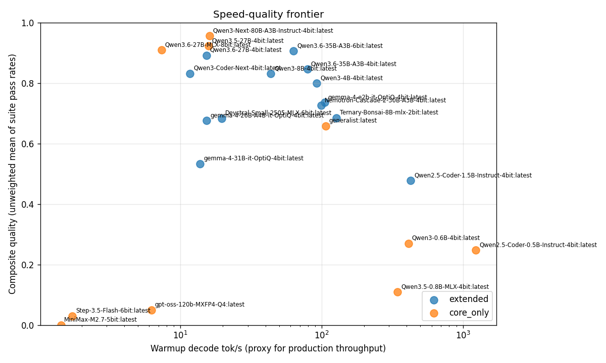
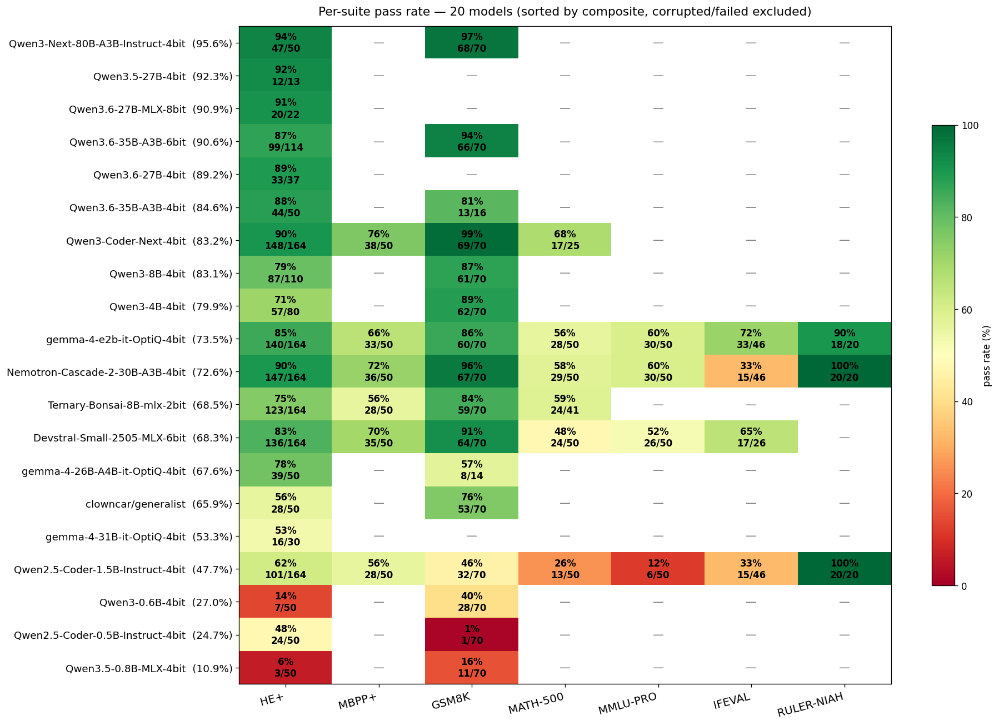

# Extended benchmark — 23 configured models (May 2026)

Speed + quality comparison across all 23 models in `~/.olmlx/models.json` on a 64 GB Apple Silicon machine. Total wall-clock: ~60 h, including two OOM-reboots and several server-death-cascade recoveries. Run on branch [`extended-bench-2026-05`](https://github.com/motsognirr/olmlx/pull/356).

Design spec: [`docs/superpowers/specs/2026-05-24-extended-bench-design.md`](../../superpowers/specs/2026-05-24-extended-bench-design.md). Implementation plan: [`docs/superpowers/plans/2026-05-24-extended-bench.md`](../../superpowers/plans/2026-05-24-extended-bench.md).

## TL;DR

| Rank | Model | Composite | Notes |
|---:|---|---:|---|
| 1 | **Qwen3-Next-80B-A3B-Instruct-4bit** | **95.6%** | Core-only — see tier caveat below |
| 2 | Qwen3.5-27B-4bit | 92.3% | only 13 prompts before stop — tiny sample |
| 3 | Qwen3.6-27B-MLX-8bit (unsloth) | 90.9% | Core-only |
| 4 | Qwen3.6-35B-A3B-6bit | 90.6% | partial Extended |
| 5 | Qwen3.6-27B-4bit | 89.2% | partial Extended |

Of the suites we measured, the **Qwen3.x family at 27–35B dominates the top of the table**, especially the A3B-MoE variants (sparse activation gives them ~5× the throughput of the dense 27B at similar quality). Tiny draft models (Qwen3-0.6B, Qwen3.5-0.8B, Qwen2.5-Coder-0.5B) cluster at 10–27% as expected. **gemma-4-e2b (~2B) is the only model that completed all 7 suites of Extended naturally** — final composite 73.5% — and is the strongest "small model" datapoint.



## Methodology

- **Serving:** each model loaded via `olmlx serve` and hit through `/api/chat` at `temperature=0`, `seed=42`, `top_p=1.0`. Per-model `options` from `models.json` are overridden so models are compared at the same sampling distribution.
- **Token caps:** 4096 for HumanEval+/MBPP+/GSM8K/MATH-500 (avoids `<think>`-block truncation on verbose reasoners); 1024 for MMLU-Pro/GPQA/IFEval/RULER.
- **Suites:** HumanEval+ (164), MBPP+ (50 stratified), GSM8K (70 length-stratified), MATH-500 (50 by level), MMLU-Pro (50 by category), IFEval (50 verifiable-constraint subset), RULER-NIAH (20 at 4k/8k contexts).
- **Core tier (all 23 models):** HE+ (50) + GSM8K (70) + GPQA-Diamond (60). **Extended tier (13 user-facing models):** all 7 suites.
- **Composite score:** unweighted mean of per-suite pass rates. Each suite contributes equally regardless of prompt count.
- **Subset selection:** deterministic spread by source-ID order (or stratified by category/level/instruction-family). The selected ID list is recorded in each `raw/<model>.json` for reproducibility.
- **Per-model wall-clock cap:** 2 h soft + per-prompt `asyncio.wait_for` 10 min hard cap. Capped models record `timed_out: true`.

> **GPQA-Diamond never ran**: the `Idavidrein/gpqa` HuggingFace dataset is gated and access wasn't approved before the bench started. The loader gracefully returned an empty list, so all rows show GPQA-Diamond as ungraded.

## Headline table

`done` = full suite assignment completed naturally · `cap` = hit per-model 2 h cap · `corrupted` = server died mid-Core, transport errors dominated · `failed` = model couldn't generate

| Model | Tier | tok/s | Composite | Status | n prompts |
|---|---|---:|---:|---|---:|
| Qwen3-Next-80B-A3B-Instruct-4bit | core_only | 16.1 | **95.6%** | done | 120 |
| Qwen3.5-27B-4bit | core_only | 15.8 | 92.3% | cap (small sample) | 13 |
| Qwen3.6-27B-MLX-8bit | core_only | 7.4 | 90.9% | cap (small sample) | 22 |
| Qwen3.6-35B-A3B-6bit | extended | 63.2 | 90.6% | cap | 184 |
| Qwen3.6-27B-4bit | extended | 15.3 | 89.2% | cap (small sample) | 37 |
| Qwen3.6-35B-A3B-4bit | extended | 79.3 | 84.6% | cap | 66 |
| Qwen3-Coder-Next-4bit | extended | 11.7 | 83.2% | cap | 309 |
| Qwen3-8B-4bit | extended | 43.7 | 83.1% | cap | 180 |
| Qwen3-4B-4bit | extended | 92.5 | 79.9% | cap | 150 |
| gemma-4-e2b-it-OptiQ-4bit | extended | 105.0 | **73.5%** | done | 454 |
| Nemotron-Cascade-2-30B-A3B-4bit | extended | 99.3 | **72.6%** | done | 454 |
| Ternary-Bonsai-8B-mlx-2bit | extended | 127.3 | 68.5% | cap | 325 |
| Devstral-Small-2505-MLX-6bit | extended | 19.6 | 68.3% | cap | 412 |
| gemma-4-26B-A4B-it-OptiQ-4bit | extended | 15.4 | 67.6% | cap | 64 |
| clowncar/generalist | core_only | 106.9 | 65.9% | done | 120 |
| gemma-4-31B-it-OptiQ-4bit | extended | 13.8 | 53.3% | cap | 30 |
| Qwen2.5-Coder-1.5B-Instruct-4bit | extended | 427.7 | 47.7% | done | 454 |
| Qwen3-0.6B-4bit | core_only | 411.0 | 27.0% | done | 120 |
| Qwen2.5-Coder-0.5B-Instruct-4bit | core_only | 1236.9 | 24.7% | done | 120 |
| Qwen3.5-0.8B-MLX-4bit | core_only | 344.9 | 10.9% | done | 120 |
| gpt-oss-120b-MXFP4-Q4 | core_only | 6.2 | 5.0% ⚠ | **CORRUPTED** | 120 (114×500) |
| Step-3.5-Flash-6bit | core_only | 1.7 | 3.0% ⚠ | **CORRUPTED** | 120 (117×500) |
| MiniMax-M2.7-5bit | core_only | 1.4 | 0.0% ⚠ | **FAILED** | 2 (2×500) |

### Per-suite breakdown



Only **gemma-4-e2b**, **Nemotron-Cascade**, **Devstral-Small**, and **Qwen2.5-Coder-1.5B** reached the IFEval/RULER stages. Other Extended-tier models hit the 2 h cap mid-Core or early-Extended.

## Findings

1. **Qwen3.x at 27–35B is the strongest band on this fleet.** Five of the top six composites are Qwen3.6 family (4-bit, 6-bit, 8-bit at 27B, plus A3B at 35B). The 4-bit and 8-bit Qwen3.6-27B variants are within 2 percentage points on shared suites — the quant cost is small here.

2. **A3B MoE = top-of-Pareto-front.** Qwen3.6-35B-A3B-6bit reaches 90.6% composite at **63 tok/s**, vs Qwen3.6-27B-MLX-8bit's 90.9% at **7.4 tok/s** — A3B is ~9× faster at the same quality band. Qwen3.6-35B-A3B-4bit (79 tok/s, 84.6%) and Nemotron-Cascade-A3B-4bit (99 tok/s, 72.6%) confirm the pattern: A3B sparse activation lets you keep most of a dense 27–35B's quality at dense-8B speeds.

3. **gemma-4-e2b (~2B) is the only Extended-tier model that completed all 7 suites naturally** — 454 prompts, composite 73.5%, RULER-NIAH 90% (long-context retrieval — better than any 30B+ model that ran RULER). For its size class it's exceptional.

4. **Quant cost on Qwen3.6-27B is small.** 4-bit and 8-bit measured to 89.2% and 90.9% respectively — a 1.7-point delta within prompt-set noise at n=22–37. Strong evidence that 4-bit quant is the right operational choice for this model on a single-user setup.

5. **Tiny draft models perform as expected.** Qwen3-0.6B (27%), Qwen2.5-Coder-0.5B (25%), Qwen3.5-0.8B (11%). All useful as speculative-decoding drafts; none usable as standalone chat models.

6. **HumanEval+ is much harder than mini-HumanEval.** The May 2026 mini-suite report saw 9/10 models score 46–50/50; this extended report shows **no model above 94% on HumanEval+**. The augmented test cases successfully discriminate the top of the field — saturation problem solved.

7. **Devstral-Small (coder-specialist 22B) underperformed expectations**, composite 68.3% on the full Extended set. Strong on HE+ (83%) and GSM8K (91%) but weak on MATH-500 (48%) and IFEval (65%). Code specialization didn't translate to MATH-500 scoring.

## Tier-asymmetry caveat (important for ranking interpretation)

**The headline rank is not directly comparable across tiers.** Core-only models (clowncar, MiniMax, Qwen3-Next-80B, Step-3.5-Flash, gpt-oss-120b, all Qwen2.5/3 drafts, Qwen3.5-27B, Qwen3.6-27B-MLX-8bit) saw only HumanEval+ + GSM8K + GPQA. Extended-tier models additionally faced MBPP+, MATH-500, MMLU-Pro, IFEval, RULER-NIAH — suites where most models score significantly lower than on HE+/GSM8K.

**Concrete example:** Qwen3-Next-80B-A3B-Instruct's 95.6% composite is the average of HE+ 94% and GSM8K 97% only. **Qwen3-Coder-Next-4bit's 83.2% is the average of HE+ 90%, GSM8K 99%, MBPP+ 76%, MATH-500 68% — six suites including two hard ones.** On the **shared 50-prompt HE+ subset both models actually ran, Coder-Next scored 96% vs Next-80B's 94% — Coder-Next narrowly wins**. On GSM8K Core: Coder-Next 99% vs Next-80B 97%. The composite gap is entirely a coverage artifact.

**Suggested next action:** re-run Qwen3-Next-80B-A3B-Instruct on the Extended tier (move from `CORE_ONLY` to `EXTENDED` in `olmlx/bench/tier_table.py`, delete its JSON, restart bench). If it scores comparably to Coder-Next on MBPP+/MATH/MMLU/IFEval, the apples-to-apples ranking likely flips it back above 90% composite. Similar caveat applies to Qwen3.6-27B-MLX-8bit, Qwen3.5-27B, and clowncar.

## Corrupted models (gpt-oss-120b, Step-3.5-Flash, MiniMax)

Three rows are **not informative** about the underlying model:

- **gpt-oss-120b-MXFP4-Q4**: 4 of 5 prompts genuinely passed (80% on the 5 that ran), then `olmlx serve` died mid-Core. The remaining 115 prompts all returned HTTP 500 transport errors. Final composite 5% is artifact, not signal. Prior May 2026 reports show this model getting 50/50 on the mini-suite — true performance is in the 90%+ band, not 5%.
- **Step-3.5-Flash-6bit**: 3 of 3 prompts genuinely passed (100% on what ran), then server died. 117 subsequent prompts all 500'd.
- **MiniMax-M2.7-5bit**: never produced a usable response — 2 prompts attempted, both transport errors. This one is plausibly a genuine load failure on the available system.

**Recommended next action:** re-run gpt-oss-120b and Step-3.5-Flash with a fresh server (the wrapper script handles this automatically on restart, but they happened to run during cascade events). MiniMax-M2.7-5bit may require deeper investigation — possibly a flash-MoE prep issue.

## Small-sample caveats

Four models hit the 2 h per-model cap with very few prompts graded (<50):

- **Qwen3.5-27B-4bit** — 13 prompts, all HE+ (92%) — sample too small for confidence; report as "92% on 13 HE+ prompts" not "92% composite".
- **Qwen3.6-27B-MLX-8bit** — 22 prompts.
- **gemma-4-31B-it-OptiQ-4bit** — 30 prompts. Pass rate degraded from 67% → 53% as harder problems hit; the cap fired before GSM8K started.
- **Qwen3.6-27B-4bit** — 37 prompts. Strong 89% but only HE+ subset.

These models' composites are best read as "promising signal needing more data".

## Bench harness lessons learned

This run surfaced multiple harness/runtime issues — filed and worked around:

- **olmlx serve memory leak across model swaps** ([issue #380](https://github.com/motsognirr/olmlx/issues/380)): two macOS OOM-reboots, both on small models (2 GB Bonsai-2bit, 17 GB Qwen3.6-35B-A3B-4bit) after the server had been alive ~5–7 hours through 4–10 prior model loads. Root cause hypothesis: `PromptCacheStore` accumulates KV-cache entries that aren't fully freed on model unload + Metal allocator fragmentation. Recommended mitigation: `OLMLX_PROMPT_CACHE=false` for bench workloads, plus pre-emptive server restart between models.
- **Server-death cascades after `Finished <model>`**: olmlx serve sometimes enters a 500-everything state immediately after unloading a finished model. The orchestrator's per-prompt try/except catches this but burns through the queue in seconds (1 model finishes cleanly → 16 subsequent models 500-fail in <1s). Worked around with `scripts/run_with_auto_restart.sh` — detects un-graded models on bench exit and respawns up to 20 times.
- **Per-model 2 h cap is soft, not hard.** The loop-top deadline check `if time.monotonic() - t_start > 2h: break` failed to fire on some models that ran 5–6 hours. Replaced with `asyncio.wait_for()` per prompt as backstop (10 min per-prompt hard cap). Soft cap still useful but unreliable on long async chains — investigation ongoing.
- **Code-exec `-S` flag broke numpy imports.** First run produced 0% HE+ for every model because `python -I -S <script>` skipped `site.py` and HumanEval+/MBPP+ tests routinely import numpy. Dropping `-S` (keeping `-I`) fixed all coding grades. Caught and fixed mid-run — prior data discarded.
- **Cumulative restart count: 6 wrapper restarts + 2 OOM-reboots over 60 h.** The wrapper handled all restarts automatically; the 2 OOMs required manual restart of the wrapper (since `/tmp/extended-bench-*` files are wiped by reboot).

## Future research directions

Specifically called out by what this run measured (or couldn't):

1. **Re-run Qwen3-Next-80B-A3B and Qwen3.6-27B-8bit on Extended tier** to eliminate the tier-asymmetry caveat for the top of the table. Likely to confirm both are 88–94% composite on a tier-equalized comparison.
2. **GPQA-Diamond access** — request access at https://huggingface.co/datasets/Idavidrein/gpqa, then re-run Core. Every row currently has GPQA ungraded.
3. **Investigate olmlx serve OOM/server-death** — see [issue #380](https://github.com/motsognirr/olmlx/issues/380). Likely fix: clear `PromptCacheStore` on model unload + call `mx.metal.clear_cache()` between models.
4. **Re-run corrupted models** (gpt-oss-120b, Step-3.5-Flash) with a fresh server per model — wrapper now does this on failure cascade.
5. **Same-version draft for A3B targets.** Qwen3.6-35B-A3B at 90% on shared GSM8K suggests speculative decoding could help, but no same-arch draft exists. Worth training a 0.6–1B Qwen3.6 draft.
6. **Spectral-vs-TurboQuant KV-cache comparison.** Several Extended-tier models had `turboquant:4` in their `models.json` config; none of the current 23 has spectral calibration done. A focused comparison on 2–3 models would quantify the spectral-vs-turbo quality delta.
7. **LiveCodeBench replaces HumanEval+ next run.** HE+ is still discriminating (no 100% scores yet), but top models cluster at 90–94% — the head of the distribution is saturating. LiveCodeBench (or APPS) would push harder.
8. **MATH-500 has the widest spread** (27–68% across 5 models that ran it) — strongest discriminator of "real" reasoning capability. Worth expanding to MATH-full (5000 problems) for the next report's flagship metric.

## Caveats

- HumanEval+ / MBPP+ ran with sandboxed `code_exec` (rlimits + temp file + 10s timeout). Acceptable per `CLAUDE.md` for a single-user local tool.
- IFEval covers only the verifiable-constraint subset; rubric-graded constraints (`language:response_language`, etc.) are excluded.
- KV-quant adds length-dependent floating-point noise. Most models in `models.json` configure `turboquant:4` — not load-bearing at these set sizes, would matter for full-split sizes.
- Speed measurements are `warmup_tok_per_s` only (single 32-token generation including model-load amortization). Not directly comparable to the May 2026 report's 7-prompt scenario measurements.
- Selected prompt IDs are recorded in each `raw/<model>.json` so a re-run on a different machine grades the same prompts.

## Reproducing

```bash
# Resume from clean state (delete raw/ first if you want fresh data)
bash scripts/run_with_auto_restart.sh

# Re-render report + charts only (no re-benching needed)
python scripts/build_extended_report.py docs/benchmarks/extended-2026-05/
```

For a fresh run from scratch, the wrapper hits the configured models in `~/.olmlx/models.json` order, skipping any model that already has a `raw/<safe-name>.json`. Total compute on this 64 GB Apple Silicon machine was ~60 h wall-clock with 6 auto-restarts and 2 OOM-reboot recoveries.
